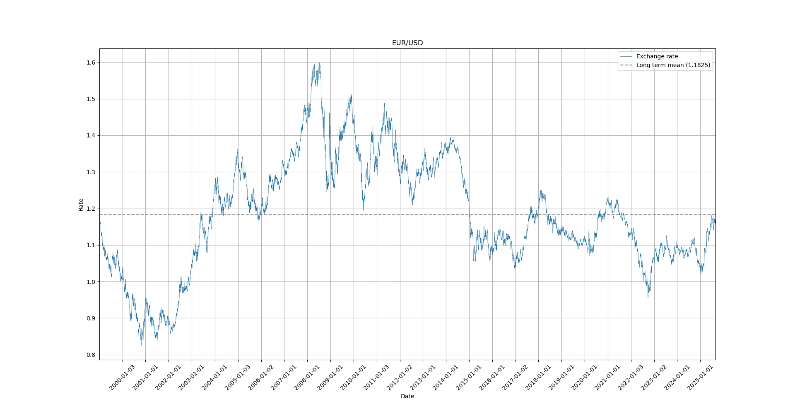

# Exchange Rates


Web scrape historical exchange rates from the European Central Bank.

> [!caution]
> The exchange rates are <u>daily reference rates</u> meant for information purposes only.
## Features

- Fetch historical exchange rates from 1999 onwards for 31 currencies
- Visualize the evolution of the rates for a quick overview
## Requirements & Usage

```python
pip install pandas
pip install matplotlib
```

Copy the `exchange_rates.py` file in your working directory.
## Example

```python
from exchange_rates import Fx
```

The `Fx` class has two parameters: `base` and `quote`. Currency pairs are displayed as "BASE/QUOTE"; the exchange rate shows how much of the *quote* currency is needed to purchase a single unit of the *base* currency.

```python
# EUR/USD currency pair
eur_usd = Fx(base="EUR",quote="USD")
```

The `spot` method returns the most recent spot rate as a (date, rate) tuple, whereas the `rates` method returns a dataframe of the historical exchange rates.

```python
# The most recent reference spot rate
spot_date, spot_rate = eur_usd.spot()
print(spot_date, spot_rate)
```

`>> 2025-08-29 00:00:00 1.1658`
One euro costs 1.1658 US dollars.

```python
# Historical rates
print(eur_usd.rates())
```

The `rates` method also accepts `reverse_index = bool` as a parameter to reverse the resulting dataframe if needed.

| Date                 |              EUR/USD |
| :------------------- | -------------------: |
| 2025-08-29 00:00:00  |               1.1658 |
| 2025-08-28 00:00:00  |               1.1676 |
| 2025-08-27 00:00:00  |               1.1593 |
| 2025-08-26 00:00:00  |               1.1656 |
| 2025-08-25 00:00:00  |               1.1697 |
| <center>...</center> | <center>...</center> |
| 1999-01-08 00:00:00  |               1.1659 |
| 1999-01-07 00:00:00  |               1.1632 |
| 1999-01-06 00:00:00  |               1.1743 |
| 1999-01-05 00:00:00  |                1.179 |
| 1999-01-04 00:00:00  |               1.1789 |

The `visualize` method displays the exchange rate of the given currency pair as well as the long term mean exchange rate.

```python
# Visualization
eur_usd.visualize()
```

